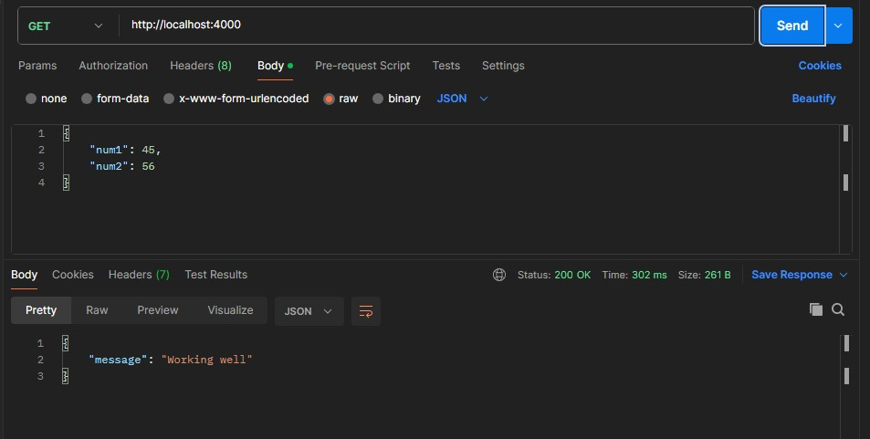
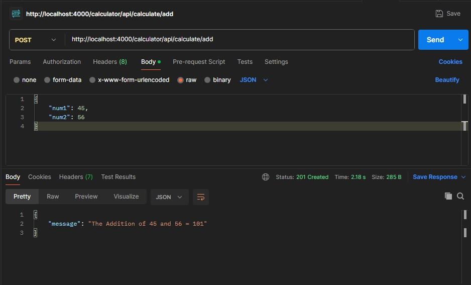
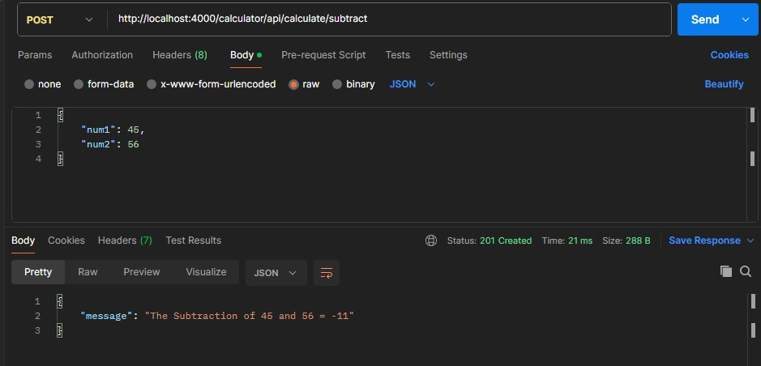
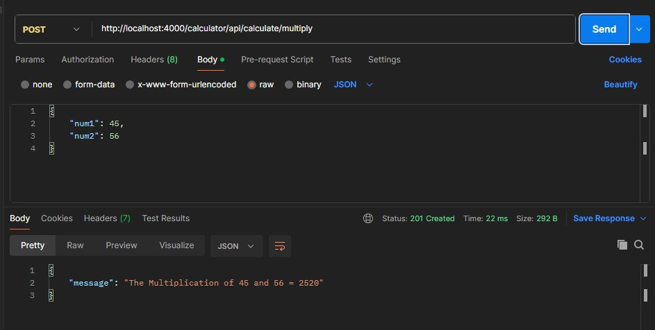
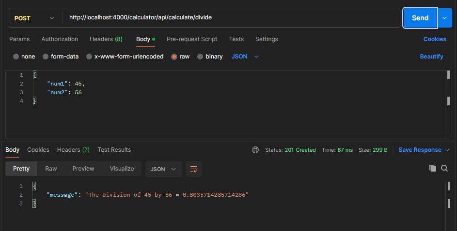

# Simple Calculator API Server

# Project Overview
This project is a simple calculator API built using ExpressJS (Node.js), providing basic arithmetic operations such as addition, subtraction, multiplication, and division. This API handles requests for performing these operations via HTTP. Additionally, the project includes a Dockerfile for containerization and was deployed on Render for testing. It was also tested using Postman.

# Features
1. **Basic Arithmetic Operations:**
- Addition
- Subtraction 
- Multiplication 
- Division
2. **Containerization:** The project includes a Dockerfile, allowing it to be easily containerized and run consistently across different environments.
3. **Deployment:** Deployed on Render, making the API publicly accessible.
4. **Postman Testing:** API endpoints were tested using Postman to ensure functionality and reliability.


# Technologies Used

- **JavaScript:** Node.js with ExpressJS for the backend server.
- **Docker:** for containerization.
- **Render:** for deployment.
- **Postman:** for testing the API endpoints.


# API Endpoints

- **POST /calculator/api/calculate/add:** Performs addition of two numbers.
- **POST /calculator/api/calculate/subtract:** Performs subtraction of two numbers.
- **POST /calculator/api/calculate/multiply:** Performs multiplication of two numbers.
- **POST /calculator/api/calculate/divide:** Performs division of two numbers.


# Project Structure

- **server.js:** Contains the main Express server logic and route handling.
- **routes/calculator.js:** Defines the API routes for the arithmetic operations.
- **Dockerfile:** Used for creating a Docker image of the application.
- **package.json:** Manages project dependencies and scripts.


# Screenshots

1. Testing the server connection
- 

2. Addition
- 

3. Subtraction
- 

4. Multiplication
- 

5. Division
- 


# Setup Instructions

1. Clone the repository to your laptop, system or computer by running this: 
```bash
 git clone https://github.com/Temitope1606/calculator-api-docker-deploy-render.git
```
2. Run the server by typing this in the terminal:
```bash
node server.js
```

3. Test the API using Postman or browser to ensure that the connection is successful and the server is running:
```bash
 http://localhost:4000
 ```

4. Test the operations API using Postman, Insomnia or any API Client:
For example: Choose **POST** as the request type
```bash
http://localhost:4000/calculator/api/calculate/divide
```


# Docker Setup

1. Build the Docker image:
```bash
docker build -t calculator-api .
```
2. Run the Docker container:
``` bash
docker run -p 4000:4000 calculator-api
```